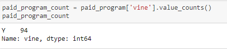
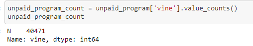
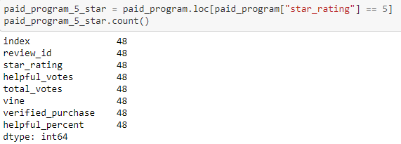
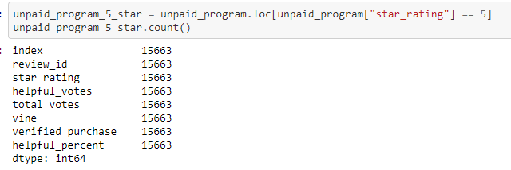
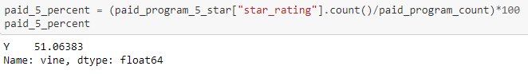
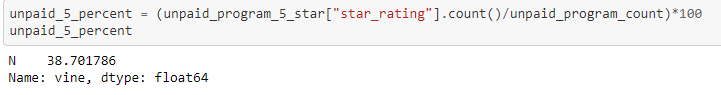

# Amazon_Vine_Analysis

## Overview of the Analysis 
The purpose of the analysis is to determine if there is any bias toward more favorable reviews with the Amazon Vine program.  The SellBy stakeholders want to ensure that the fee they are paying to Amazon is generating accurate reviews.  This analysis is looking at the reviews of video game products.  

## Results

* How many Vine reviews and non-Vine reviews were there?
There were 94 vine reviews and 40,471 non-Vine reviews. 

* How many Vine reviews were 5 stars? How many non-Vine reviews were 5 stars?
Vine reviews that were 5 stars totaled 48, while the non-Vine reviews that were 5 stars totaled 15,663. 

* What percentage of Vine reviews were 5 stars? What percentage of non-Vine reviews were 5 stars?

The Vine reviews that were 5 stars totaled 51.06%, while the non-Vine reviews that were 5 stars totaled only 38.70%.

## Summary 
There is a positivity bias for reviews within the Vine program.  Even though there are less vine reviews 51.06% are rated with 5 stars.  If there was a bias with both types of reviews then the percentage of non-vine reviews that were 5 stars would be higher. It can be determined that Amazon is providing the reviewers with substantial incentive to rate higher on average. I would run a regression analysis to determine if other factors such as the verified purchase component has an affect on the rating. 
